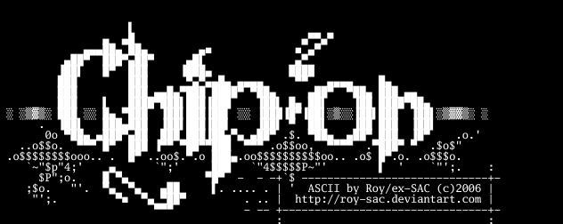

# ASCII to image converter

Needed a nerdy project while learning Go. The purpose of this program is to convert ASCII art files into PNG images. 

[ASCII art](https://en.wikipedia.org/wiki/ASCII_art) and so-called "block ASCII" or "high ASCII" uses the extended characters of the 8-bit [Code Page 437](https://en.wikipedia.org/wiki/Code_page_437) (the character set of the original IBM PC).

Example:



Using a copy of the [cp437](https://pkg.go.dev/github.com/BenLubar/df2014@v0.0.0-20170608221706-a0f82c11e116/cp437) module to avoid dependencies. Using this to convert between CP437 and UTF-8, to get the extended characters to work properly.

## Usage

```
go run . <ascii-file>
```

### ASCII ART

Well, you need some ascii art files. Run the follwing commands to obtain some nice ascii art by [Roy/SAC](https://roysac.com/).

```
curl -o roy_ascii.zip http://www.roysac.com/images/galleries/ZIP/Roy_ASCII.ZIP

unzip roy_ascii.zip -d ascii

rm roy_ascii.zip
```

## TODO

```
[X] Convert ASCII files to image
[ ] Convert ANSI files to image
```